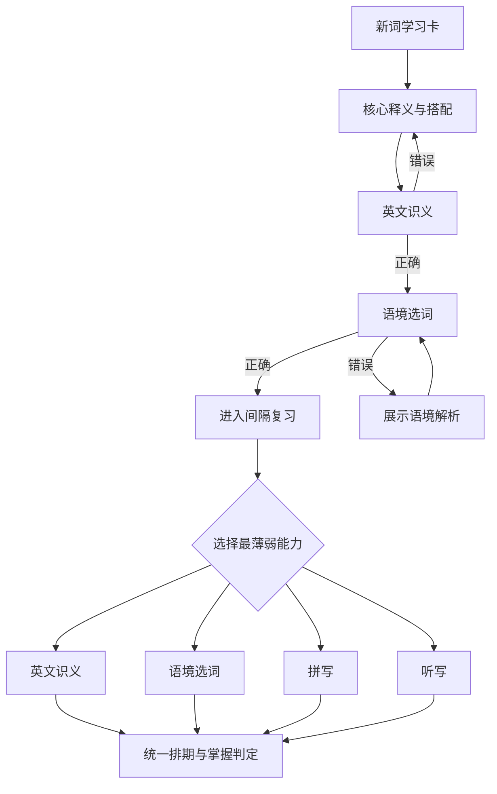

# 高考语义能力练习设计

## 目标与范围

本设计的首期选择题方案已经落地。在现有拼写、听写之外增加两种更贴近高考阅读、完形和语法填空的能力：

- `recognition`：看到英文后识别核心中文义项。
- `context`：根据句子语境选择正确单词或词形。

首期使用服务端生成并判分的选择题，暂不使用自由中文翻译。自由文本存在同义词、语序和表述差异，稳定判分成本较高，可在后续作为开放练习而非掌握门槛。

## 学习流程



## 题型形式

### 英文识义 `recognition`

- 题面：英文单词、音标，可选朗读；不显示中文释义。
- 答案：四个中文选项，选择最符合当前义项的一项。
- 干扰项：优先选择相同词性、相近难度、容易混淆的词义。
- 多义词：每次只测试一个 `sense_id`，题面可带一条不暴露答案的短语或例句。
- 判分：服务端按 `option_id` 判定，客户端不提交“是否正确”。

### 语境选词 `context`

- 题面：一个挖空英文句子和必要的中文语境。
- 答案：首期为四选一；选项保持同词性，必要时包含派生词或易混词。
- 进阶：掌握度较高后切换为输入单词，并根据 `example_form` 判断词形。
- 错误反馈：显示完整句子、译文、正确义项以及错误选项不适用的原因。
- 例句质量不足或缺少可靠干扰项时，自动回退到拼写题，不生成低质量题目。

## 每日任务中的能力权重

建议的高考模式基础权重：

| 能力 | 权重 | 主要目标 |
|---|---:|---|
| 英文识义 | 35% | 阅读中的快速词义提取 |
| 语境选词 | 35% | 完形、阅读和语法填空 |
| 拼写 | 20% | 写作、词形和准确输出 |
| 听写 | 10% | 听力与音形映射 |

实际选题继续遵循“最薄弱能力优先”，权重只约束 7 天滚动分布，避免某一能力长期缺席。无音频设备时，听写份额转给英文识义，不再全部转给拼写。

## 数据模型

在现有 `review_states[word_key].mastery` 下追加维度，旧字段保持不变：

```json
{
  "mastery": {
    "spelling": {},
    "listening": {},
    "recognition": {
      "score": 0.0,
      "attempts": 0,
      "correct": 0,
      "streak": 0,
      "last_review_date": null,
      "avg_response_ms": 0
    },
    "context": {
      "score": 0.0,
      "attempts": 0,
      "correct": 0,
      "streak": 0,
      "last_review_date": null,
      "avg_response_ms": 0
    }
  }
}
```

题目本身不持久化到逐词状态；每日任务项只保存 `exercise_type` 和带内容指纹的 `question_id`。服务端从私有版本化题库读取正确答案，继续复用当前 `review_event_id` 幂等机制。

## API 流程

1. `/api/words/review` 返回题目类型和公开题面。
2. `recognition` 返回英文、`question_id` 和无正确标记的中文选项。
3. `context` 返回挖空句、选项和题目版本，不返回答案字段。
4. `/api/words/practice` 接收 `question_id`、`selected_option_id` 或输入答案。
5. 服务端校验题目属于当前任务项，完成判分并更新对应 mastery 维度。
6. 重放相同 `review_event_id` 返回第一次结果；不同答案复用事件 ID 时返回冲突。

## 掌握判定

高考模式不再要求四个维度简单平均。建议门槛：

- `recognition`：至少 3 次，得分不低于 0.65。
- `context`：至少 3 次，得分不低于 0.65。
- `spelling`：至少 2 次，得分不低于 0.55。
- `listening`：作为增强项，不阻止无音频环境下的掌握。
- 继续保留跨日成功次数和维护复习，避免短时间刷题直接掌握。

## 题目质量与降级

- 干扰项必须与正确项词性一致，且不能是可接受同义答案。
- 原始例句只作为义项参考；生成时重写为带固定搭配、因果、对比或具体事实等唯一限定线索的完整语境。
- 候选题须经过独立的逐选项代入审查；普通语境下存在两个自然、合理答案时整题拒绝入库。
- 过短语境、答案词形无法唯一定位、审查结果缺项或审查响应不可靠时均拒绝入库。
- 当前题型无法可靠生成时直接降级到拼写，避免用另一种题型改变既定能力记录。
- 记录题目来源和版本，便于发现错误题目后批量下线，不改写历史作答。

## 后续演进

1. **题库质检**：补充歧义反馈与题目下线工具，人工抽检高频词。
2. **稳定义项**：为高中词库补齐 `sense_id`，让多义词题目可独立版本化。
3. **难度分层**：根据掌握度选择基础识义或更接近完形的干扰项。
4. **长期验证**：比较 30/90 天保持率、平均答题时间和高频错词回流率。

## 验收测试

- 同义中文选项不会产生双重正确答案。
- 多义词的 `sense_id` 与例句、选项一致。
- 客户端篡改正确标记不能影响服务端判分。
- 旧用户缺少新维度时可无损初始化，旧版本仍能读取主学习文件。
- 无音频、无例句或题目被下线时可稳定降级。
- 四种练习的事件重放、冲突检测和跨 worker 写入保持幂等。
